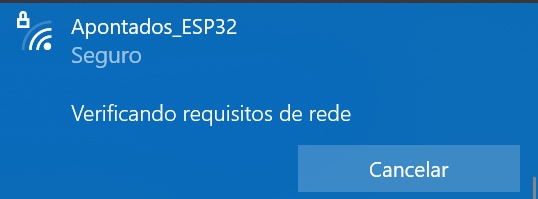
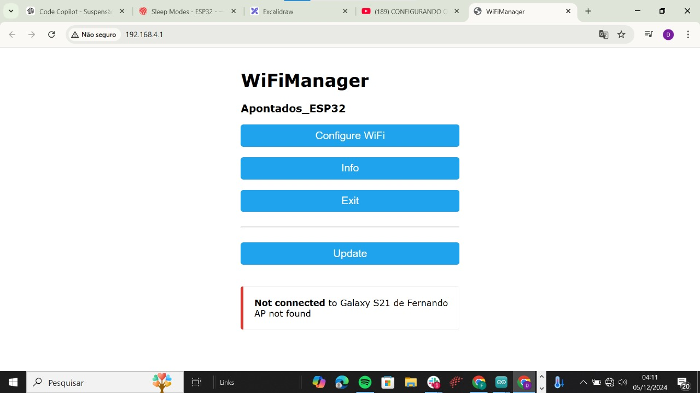
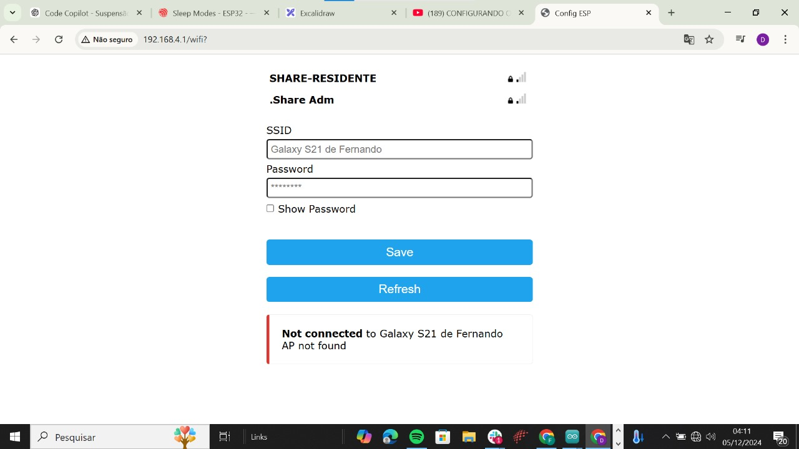
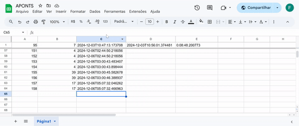

Nesta seção, apresentamos um **Diagrama de Sequência UML** que ilustra detalhadamente as interações entre os componentes do sistema em um cenário específico. Esse diagrama destaca o fluxo de mensagens e as ações realizadas pelos diferentes elementos, como o ESP32, broker MQTT, servidor web e banco de dados, ao atender a uma requisição de cadastro de digital. O protótipo físico apresentado nesta seção representa a integração de hardware e software em uma solução conectada via Wi-Fi e comunicação MQTT. Este protótipo foi projetado para validar o funcionamento completo do sistema em um ambiente conectado, permitindo o registro e monitoramento remoto de eventos, especificamente autenticações biométricas, além de fornecer feedback visual e sonoro em tempo real.

Os diagramas foram desenvolvidos com o objetivo de alinhar as funcionalidades da aplicação às necessidades dos usuários e stakeholders, evidenciando tanto o fluxo das operações quanto os estados e comportamentos do sistema. No contexto de sistemas IoT (Internet das Coisas), onde a comunicação e a integração entre dispositivos desempenham um papel central, essas representações visuais são ferramentas úteis para compreender e validar as diferentes camadas da solução.

Os Diagramas de Sequência UML cumprem um papel fundamental ao:
- **Demonstrar as interações entre componentes**: Facilitam a visualização da comunicação e colaboração entre diferentes elementos do sistema.
- **Fluxo de dados**: Detalham a troca de mensagens e respostas ao longo do tempo, permitindo identificar dependências e otimizar o desempenho.

Essa abordagem fornece aos desenvolvedores e gestores uma visão completa da solução, conectando a experiência do usuário (UX) ao funcionamento técnico e operacional do sistema. A seguir, exploramos detalhadamente cada diagrama, explicando como ele reflete a arquitetura e os fluxos de trabalho do projeto.

#### 3.4.4.1 **Registro de Situações de Uso**

<div align="center">
  <sub>Figura X - Diagrama UML - Fluxo de Cadastro de Digital</sub><br>
  <br>
  <sup>Fonte: Material produzido pelos autores (2024)</sup>
</div>

#### 3.4.4.1.1 **UML de cadastro de usuário**

| **#** | **Nome do Teste**                                                                                     | **Configuração do Ambiente**                                                                                     | **Ação do Usuário**                                                                                             | **Resposta Esperada do Sistema**                                                                                                     | **Resposta Recebida do Sistema**                                                                                                                                                      |
|-------|-------------------------------------------------------------------------------------------------------|------------------------------------------------------------------------------------------------------------------|----------------------------------------------------------------------------------------------------------------|--------------------------------------------------------------------------------------------------------------------------------------|---------------------------------------------------------------------------------------------------------------------------------------------------------------------------------------|
| 01    | **Cadastro Biométrico Inicial**                                                                       | O ESP32 deve estar configurado com acesso ao Wi-Fi e conectado ao broker MQTT. O sensor biométrico e o LCD devem estar corretamente inicializados. | Colocar o dedo no sensor biométrico para iniciar o cadastro.                                                    | O sensor biométrico lê a digital e exibe no LCD: **"Cadastrar: Nome, ID"**.                                                          | O sensor leu a digital com sucesso e o LCD exibiu a mensagem de progresso no cadastro.                                                                                               |
| 02    | **Envio de Dados para o Servidor**                                                                    | O ESP32 deve estar conectado ao broker MQTT, e o servidor web deve estar funcionando com o banco de dados PostgreSQL acessível. | Realizar o cadastro no ESP32 para enviar a digital ao servidor.                                                 | O ESP32 envia os dados ao servidor, que os registra no banco de dados, retornando a mensagem de sucesso exibida no LCD: **"Sucesso"**. | O ESP32 publicou os dados corretamente, o servidor confirmou o cadastro, e o LCD exibiu a mensagem esperada.                                                                         |
| 03    | **Autenticação Biométrica e Acesso Permitido**                                                        | O ESP32 deve estar configurado para comunicação MQTT, o relé deve estar conectado à fechadura eletrônica e o LED ao sistema de feedback. | Solicitar uma autenticação biométrica no sistema colocando o dedo no sensor.                                    | O ESP32 valida a digital, acende o LED verde, exibe no LCD **"Acesso Permitido"**, e aciona o relé para liberar a fechadura.         | A autenticação foi realizada com sucesso: LED verde aceso, mensagem de permissão exibida no LCD, e o relé ativado corretamente.                                                       |
| 04    | **Reconexão Automática após Perda de Wi-Fi**                                                          | O ESP32 deve estar conectado ao broker MQTT e configurado para tentar reconectar automaticamente em caso de falha de comunicação. | Reiniciar o sistema para simular perda de conexão Wi-Fi e tentar acessar o sistema.                              | O ESP32 exibe no LCD: **"Erro na Conexão"**, tenta reconectar a cada 5 segundos e, após o sucesso, retorna ao estado normal.          | O ESP32 detectou a perda de conexão, exibiu a mensagem de erro no LCD, tentou reconectar, e restabeleceu a comunicação com o broker MQTT após algumas tentativas.                       |
| 05    | **Verificação de Duplicidade no Cadastro Biométrico**                                                 | O sensor biométrico do ESP32 deve estar configurado para verificar duplicidades no armazenamento local antes de enviar ao servidor. | Tentar cadastrar uma digital já registrada no sistema.                                                          | O ESP32 exibe no LCD: **"Dedo já cadastrado"** e interrompe o processo de cadastro.                                                  | A verificação local detectou duplicidade, exibindo corretamente a mensagem no LCD e encerrando o fluxo.                                                                              |
| 06    | **Publicação de Alertas de Falha no Sistema**                                                         | O ESP32 deve estar configurado para capturar erros e publicar alertas no tópico MQTT apropriado.                  | Simular uma falha no sensor biométrico durante o processo de leitura da digital.                                 | O ESP32 publica no tópico **"instituto/erro/sistema"** indicando a falha.                                                            | A falha foi corretamente detectada e publicada no tópico MQTT.                                                                                                                        |
| 07    | **Armazenamento de Registros no Banco de Dados** | O ESP32 deve estar configurado para enviar dados via MQTT ao servidor web, que está conectado ao banco de dados Render. O banco de dados deve estar ativo e acessível. | O ESP32 publica um registro (e.g., digital biométrica, ID ou status de acesso) para armazenamento no banco de dados. | O servidor web processa a solicitação e armazena os registros enviados pelo ESP32 no banco de dados Render. | O banco de dados registrou corretamente os dados recebidos. |

#### Explicação dos Testes

1. **Teste 1: Cadastro Biométrico Inicial**
   - **Cenário**: Início do cadastro biométrico pelo sensor.
   - **Detalhe**: O sistema lê a digital do usuário e exibe no LCD as informações necessárias para continuar o cadastro.

2. **Teste 2: Envio de Dados para o Servidor**
   - **Cenário**: Cadastro biométrico concluído e envio de dados para o servidor.
   - **Detalhe**: O ESP32 envia a digital capturada para o servidor, que armazena os dados no banco de dados e retorna uma mensagem de sucesso.

3. **Teste 3: Autenticação Biométrica e Acesso Permitido**
   - **Cenário**: Autenticação bem-sucedida pelo sistema.
   - **Detalhe**: O ESP32 valida a digital localmente e, em caso de sucesso, acende o LED verde, exibe uma mensagem de permissão no LCD, e libera a fechadura pelo relé.

4. **Teste 4: Reconexão Automática após Perda de Wi-Fi**
   - **Cenário**: Conexão com o broker MQTT perdida durante a operação.
   - **Detalhe**: O ESP32 tenta reconectar automaticamente ao broker MQTT e, após sucesso, retoma suas funções normais, exibindo mensagens de status no LCD.

5. **Teste 5: Verificação de Duplicidade no Cadastro Biométrico**
   - **Cenário**: Tentativa de cadastrar uma digital já existente.
   - **Detalhe**: O ESP32 verifica localmente se a digital já está cadastrada e, caso encontre duplicidade, exibe uma mensagem de erro no LCD e encerra o fluxo de cadastro.

6. **Teste 6: Publicação de Alertas de Falha no Sistema**
   - **Cenário**: Sensor biométrico falha durante a leitura da digital.
   - **Detalhe**: O sistema detecta a falha no sensor biométrico, publica um alerta no tópico MQTT e exibe uma mensagem de erro no LCD.

7. **Teste 7: Armazenamento de Registros no Banco de Dados**
   - **Cenário**: O servidor armazena registros enviados pelo ESP32.
   - **Detalhe**: O ESP32 envia dados como digitais biométricas ou status de acesso ao servidor, que processa e registra corretamente no banco de dados Render.


#### 3.4.4.1.2 **UML de cadastro de tentativa de acesso**

<div align="center">
  <sub>Figura X - Diagrama UML - Fluxo de Cadastro de Digital</sub><br>
  <br>
  <sup>Fonte: Material produzido pelos autores (2024)</sup>
</div>


| **#** | **Nome do Teste**                    | **Configuração do Ambiente**                                                                                     | **Ação do Usuário**                                      | **Resposta Esperada do Sistema**                                                                                                     | **Resposta Recebida do Sistema**                                                                                                                                                      |
|-------|--------------------------------------|------------------------------------------------------------------------------------------------------------------|---------------------------------------------------------|--------------------------------------------------------------------------------------------------------------------------------------|---------------------------------------------------------------------------------------------------------------------------------------------------------------------------------------|
| 01     | **Acesso Negado**                   | O ESP32 deve estar conectado ao broker MQTT e com o banco de dados PostgreSQL acessível para verificar digitais. | Usuário coloca o dedo no sensor biométrico.             | O ESP32 exibe no LCD: **"Acesso Negado"**, acende o LED vermelho e o buzzer emite um som longo.                                       | O ESP32 exibiu no LCD: **"Acesso Negado"**, acendeu o LED vermelho e o buzzer emitiu um som longo.                                                                                    |
| 02     | **Acesso Permitido**                | O ESP32 conectado ao broker MQTT, servidor web Flask ativo e banco PostgreSQL com a digital cadastrada.          | Usuário coloca o dedo no sensor biométrico.             | O ESP32 exibe no LCD: **"Acesso Permitido"**, LED verde acende, e o relé libera a fechadura.                                          | O ESP32 exibiu no LCD: **"Acesso Permitido"**, LED verde acendeu, e o relé ativou a fechadura corretamente.                                                                           |
| 03     | **Banco de Dados Inacessível**      | O ESP32 conectado ao broker MQTT, mas o banco de dados PostgreSQL está offline.                                  | Usuário coloca o dedo no sensor biométrico.             | O ESP32 exibe no LCD: **"Erro no Sistema"**.  | O ESP32 exibiu no LCD: **"Erro no Sistema"**.                                                                                   |
| 04     | **Reconexão Automática**            | O ESP32 perdeu a conexão com o broker MQTT e tenta reconectar automaticamente.                                   | Reiniciar o sistema para simular perda de conexão Wi-Fi. | O ESP32 exibe no LCD: **"Erro na Conexão"**, tenta reconectar a cada 5 segundos e, após sucesso, retorna ao estado normal.            | O ESP32 detectou a perda de conexão, exibiu no LCD: **"Erro na Conexão"**, tentou reconectar, mas não restabeleceu a comunicação com o broker MQTT após tentativas.                    |
| 05     | **Digital já Cadastrada**           | O ESP32 configurado com verificações locais e conexão ao broker MQTT.                                            | Tentar cadastrar uma digital já registrada no sistema.  | O ESP32 exibe no LCD: **"Dedo já cadastrado"** e interrompe o processo de cadastro.                                                  | O ESP32 exibiu corretamente no LCD: **"Dedo já cadastrado"** e encerrou o fluxo de cadastro.                                                                                           |
| 06     | **Falha no Sensor Biométrico**      | O ESP32 conectado ao broker MQTT, mas o sensor biométrico não responde.                                          | Colocar o dedo no sensor biométrico.                    | O ESP32 publica no tópico **"instituto/erro/sistema"** indicando a falha e exibe no LCD: **"Erro no Sensor"**.                        | A falha foi corretamente detectada, o ESP32 publicou no tópico MQTT, e o LCD exibiu a mensagem: **"Erro no Sensor"**.                                                                 |
---


#### Explicação dos Testes

1. **Teste 1: Acesso Negado**
   - **Cenário**: Digital não encontrada no banco de dados local.
   - **Detalhe**: O sistema verifica localmente a digital e, se não encontrar, exibe uma mensagem negativa no LCD.

2. **Teste 2: Acesso Permitido**
   - **Cenário**: Digital encontrada e validada com sucesso.
   - **Detalhe**: O ESP32 executa uma consulta localmente, valida a digital e retorna feedback ao usuário.

3. **Teste 3: Banco de Dados Inacessível**
   - **Cenário**: O banco de dados não está acessível.
   - **Detalhe**: O ESP32 detecta o erro e publica mensagens de falha no tópico MQTT.

4. **Teste 4: Reconexão Automática**
   - **Cenário**: Perda de conexão Wi-Fi.
   - **Detalhe**: O ESP32 tenta reconectar ao broker MQTT automaticamente e retoma as operações normais.

5. **Teste 5: Digital já Cadastrada**
   - **Cenário**: Tentativa de cadastrar uma digital duplicada.
   - **Detalhe**: O ESP32 realiza uma verificação local e impede o fluxo de cadastro.

6. **Teste 6: Falha no Sensor Biométrico**
   - **Cenário**: Sensor biométrico não responde corretamente.
   - **Detalhe**: O sistema detecta a falha e publica alertas no broker MQTT.


#### 3.4.4.1.3 **Configuração do Ambiente**

Para realizar os testes descritos, o ambiente deve estar configurado da seguinte forma:

#### **Hardware**
- **ESP32**: Microcontrolador central responsável pela comunicação com sensores e o broker MQTT.
- **Sensor Biométrico (DY50)**: Captura impressões digitais para autenticação e cadastro.
- **Relé**: Controla a abertura de fechaduras eletrônicas.
- **LEDs**:
  - Verde: Indica sucesso em autenticação.
  - Vermelho: Indica falha na autenticação.
  - Azul: Indica que o sistema está em plen o funcionamento.
- **Buzzer**: Emite sinais sonoros como feedback adicional.
- **Display LCD (I2C)**: Exibe mensagens em tempo real para o usuário, como "Acesso Permitido", "Acesso Negado" e "Erro no Cadastro".

### **Software**
- **Conexão Wi-Fi**: Configurada para conectar o ESP32 ao broker MQTT (Deve ser configurada através do hotspot). 
- **Broker MQTT (HiveMQ Cloud)**:
  - Centraliza a comunicação de eventos, registrando mensagens enviadas pelo protótipo.
  - Tópicos configurados:
    - `instituto/cadastro`
    - `instituto/acesso`
- **Servidor Web (Flask)**:
  - Recebe os dados publicados pelo ESP32 via MQTT.
  - Processa e registra as informações no banco de dados.

- **Banco de Dados (Render)**:
- Recebe os registros do ESP32 e os armazena. 
---


#### 3.4.4.1.4 **Tabela de Componentes Utilizados**

| **Componente**              | **Descrição**                                                                                   | **Função no Sistema**                                                                                   | **Quantidade** |
|------------------------------|-----------------------------------------------------------------------------------------------|---------------------------------------------------------------------------------------------------------|----------------|
| **ESP32**                    | Microcontrolador com suporte a Wi-Fi e Bluetooth.                                             | Gerencia a comunicação entre os sensores, servidor e feedback ao usuário.                               | 1              |
| **Sensor Biométrico DY50**   | Sensor de leitura de digitais.                                                               | Captura digitais para cadastro e autenticação.                                                          | 1              |
| **LCD I2C (16x2)**           | Display com comunicação via I2C.                                                             | Exibe mensagens de status e feedback ao usuário.                                                        | 1              |
| **LED RGB**                  | LED tricolor (vermelho, verde, azul).                                                        | Indica status de operação, como sucesso, falha ou erro na conexão.                                      | 1              |
| **Buzzer**                   | Emissor de som.                                                                              | Emite sons para indicar feedback, como falhas ou sucesso nas operações.                                 | 1              |
| **Relé**                     | Interruptor eletrônico.                                                                      | Controla a abertura da fechadura eletrônica.                                                            | 1              |
| **Fechadura Eletrônica**     | Fechadura operada eletronicamente.                                                           | Controla o acesso físico ao ambiente.                                                                   | 1              |
| **MQTT Broker (HiveMQ)**     | Protocolo de comunicação IoT.                                                                | Facilita a comunicação entre o ESP32 e o servidor.                                                      | 1 (virtual)    |
| **Servidor Web (Flask)**     | Servidor web escrito em Python.                                                              | Processa requisições do ESP32 e interage com o banco de dados.                                          | 1 (virtual)    |
| **Banco de Dados PostgreSQL**| Sistema de gerenciamento de banco de dados relacional.                                       | Armazena informações de cadastro, autenticações e registros de acesso.                                  | 1 (virtual)    |
| **Fonte de Alimentação 5V**  | Fonte de energia.                                                                            | Alimenta os componentes do sistema, como ESP32, LCD, sensor biométrico e LED.                           | 1              |
| **Resistores e Cabos**       | Componentes eletrônicos auxiliares.                                                         | Conexões elétricas e controle de tensão nos circuitos.                                                  | Variado        |
| **Conexão Wi-Fi**            | Rede sem fio.                                                                                | Permite a comunicação do ESP32 com o broker MQTT e o servidor.                                          | 1 (infraestrutura) |
| **Protoboard**            | Placa de prototipagem.                                                                                | Permite as ligações eletrônicas do circuito.                                          | 2  |
| **Botões**                   | Emissor de som.                                                                              | Emite sons para indicar feedback, como falhas ou sucesso nas operações.                                 | 1              |


#### **Relação Atualizada de Conexões do Sistema com Portas do ESP32 (Incluindo Botões)**

| **Componente**                | **Porta(s) do ESP32** | **Descrição da Conexão**                                                                                |
|--------------------------------|-----------------------|----------------------------------------------------------------------------------------------------------|
| **Sensor Biométrico DY50**      | RX: 16, TX: 17       | Comunicação UART para envio de dados capturados pelo sensor biométrico para o ESP32.                    |
| **LCD I2C**                     | SDA: 21, SCL: 22     | Comunicação I2C para exibição de mensagens como "Acesso Permitido" ou "Erro no Sistema".                |
| **LED RGB**                     | Vermelho: 25, Verde: 26, Azul: 27 | Conexão GPIO para controle de cores indicando sucesso, falha ou estados do sistema.                     |
| **Buzzer**                      | Pino 14              | Conexão GPIO para emissão de sinais sonoros indicando erros ou ações realizadas.                        |
| **Relé**                        | Pino 13              | Conexão GPIO para ativação/desativação do relé que controla a fechadura eletrônica.                      |
| **Botão 1**                     | Pino 32              | Botão de **aceitação** (e.g., confirmações de acesso ou ações do sistema).                               |
| **Botão 2**                     | Pino 33              | Botão de **recusa** (e.g., cancela ou nega ações do sistema).                                            |
| **Conexão Wi-Fi**               | -                    | Configuração interna para comunicação do ESP32 com o broker MQTT e o servidor Flask via Wi-Fi.          |
| **Fonte de Alimentação 5V**     | VIN e GND            | Alimentação de energia para o ESP32 e os periféricos conectados (sensor biométrico, LCD, LEDs, etc.).    |
---

##### Esquema Detalhado de Conexões no ESP32

- **Sensor Biométrico DY50**
  - **RX do Sensor → Pino TX do ESP32 (17)**
  - **TX do Sensor → Pino RX do ESP32 (16)**

- **LCD I2C**
  - **SDA → Pino 21 do ESP32**
  - **SCL → Pino 22 do ESP32**

- **LED RGB**
  - **Vermelho → Pino 25 do ESP32**
  - **Verde → Pino 26 do ESP32**
  - **Azul → Pino 27 do ESP32**

- **Buzzer**
  - **Entrada Positiva → Pino 14 do ESP32**

- **Relé**
  - **Controle → Pino 13 do ESP32**

- **Botões**
  - **Botão 1 (Aceitação) → Pino 32 do ESP32**
  - **Botão 2 (Recusa) → Pino 33 do ESP32**

- **Fonte de Alimentação**
  - **VIN → Fonte 5V**
  - **GND → Terra**
 

#### 3.4.4.2 **Botões**

Na versão atual do sistema, foram adicionados dois botões para melhorar o controle do dispositivo. O Botão 1 é responsável por ativar o modo de repouso, desativando temporariamente as operações do sistema. O dispositivo retorna ao estado ativo ao pressionar o botão novamente. Já o Botão 2 é utilizado para reiniciar o dispositivo, permitindo uma rápida recuperação em caso de necessidade de ajustes ou falhas. Ambos os botões estão conectados ao ESP32 e configurados para executar essas funções essenciais, garantindo maior eficiência e praticidade no uso do sistema. 

##### **Imagens dos botões**

<div align="center">
  <sub>Figura X - botões no circuito</sub><br>
  <br>
  <sup>Fonte: Material produzido pelos autores (2024)</sup>
</div>

<div align="center">
  <sub>Figura X - Botões no circuito (Vista de cima)</sub><br>
  <br>
  <sup>Fonte: Material produzido pelos autores (2024)</sup>
</div>

<div align="center">
  <sub>Figura X - Botões no circuito (Aproximado)</sub><br>
  <br>
  <sup>Fonte: Material produzido pelos autores (2024)</sup>
</div>

###### 3.4.4.2.1 **Modo de suspensão**
O modo de suspensão no ESP32 é um estado de baixo consumo de energia em que o dispositivo desativa componentes não essenciais, mantendo apenas os necessários para acordar o sistema, como GPIOs configurados ou temporizadores. É usado para economizar energia enquanto aguarda uma ação para retomar as operações normais. Em nosso projeto, ele pode ser ativado ao pressionar o Botão 1 (GPIO 25): 
<div align="center">
  <sub>Figura X - Modo de Suspensão</sub><br>
  <br>
  <sup>Fonte: Material produzido pelos autores (2024)</sup>
</div>

###### **Implementação**

```cpp
void desligarEsp32() {
  int leitura = digitalRead(BUTTON);  // Leitura do estado do botão
  if (leitura == LOW && millis() - ultimoTempoBotao > intervaloDebounce) {
    // Botão pressionado após o intervalo de debounce
    ultimoTempoBotao = millis();
    Serial.println("Desligando ESP32...");
    lcd.clear();
    lcd.setCursor(0, 0);
    lcd.print("Dispositivo em ");
    lcd.setCursor(0, 1);
    lcd.print("modo suspensao!");

    // Aguarda a liberação do botão antes de configurar o deep sleep
    while (digitalRead(BUTTON) == LOW) {
      Serial.println("Aguardando liberação do botão...");
      delay(50);
    }

    Serial.println("Botão liberado, entrando em modo de suspensão.");

    // Configura GPIO25 como wake-up source
    esp_sleep_enable_ext1_wakeup(GPIO_SEL_25, ESP_EXT1_WAKEUP_ALL_LOW);

    // Adiciona um pequeno atraso para estabilização
    delay(100);

    // Entra no modo deep sleep
    esp_deep_sleep_start();
  }
}
```

###### 3.4.4.2.2 **Modo de reinício**
O modo de reinício no ESP32 é uma operação que interrompe todas as funções em execução e reinicia o microcontrolador, restabelecendo o estado inicial do sistema. Ele é útil para aplicar configurações atualizadas ou resolver falhas temporárias.
<div align="center">
  <sub>Figura X - Modo de Reinicio</sub><br>
  <br>
  <sup>Fonte: Material produzido pelos autores (2024)</sup>
</div>

###### **Implementação**

```cpp
void reiniciarEsp32() {
  int leituraR = digitalRead(BUTTON2);  // Leitura do estado do botão
  if (leituraR == LOW && millis() - ultimoTempoBotao > intervaloDebounce) {
    Serial.println("Reiniciando ESP32...");
    lcd.clear();
    lcd.setCursor(0, 0);
    lcd.print("Reinicio em");
    lcd.setCursor(0, 1);
    lcd.print("breve!");

    delay(100);

    // Desabilita outras fontes de wake-up
    esp_sleep_disable_wakeup_source(ESP_SLEEP_WAKEUP_EXT1);

    // Configura temporizador como única fonte de wake-up
    esp_sleep_enable_timer_wakeup(10 * 500000); // Configuração para acordar após 5 segundos

    // Entra no modo deep sleep
    esp_deep_sleep_start();
  }
}
```

#### 3.4.4.3 **Hotspot** 

O Hotspot no ESP32 é uma funcionalidade que permite ao dispositivo operar como um ponto de acesso Wi-Fi (Access Point - AP). Nesse modo, o ESP32 cria sua própria rede Wi-Fi, possibilitando que outros dispositivos se conectem diretamente a ele, sem a necessidade de um roteador intermediário.

No contexto deste projeto, o hotspot é utilizado para simplificar a configuração de redes Wi-Fi. Com a ajuda da biblioteca WiFiManager, o ESP32 cria um ponto de acesso local que hospeda uma interface web. Por meio dessa interface, o usuário pode configurar as credenciais da rede Wi-Fi de maneira dinâmica e intuitiva, eliminando a necessidade de inserir essas informações diretamente no código.

#### **Implementação**

```cpp
void setupWiFi() {
  WiFi.mode(WIFI_AP_STA);  // Configura o ESP32 em modo Access Point + Station
  WiFiManager wm;
  lcd.setCursor(0, 0);
  lcd.print("Conectando WiFi");

  bool res;
  res = wm.autoConnect("Apontados_ESP32", "Instituto"); // Ponto de acesso protegido por senha

  if (!res) {
    Serial.println("Captive portal falhou. Esperando 1 minuto antes de reiniciar.");
    lcd.clear();
    lcd.setCursor(0, 0);
    lcd.print("Falha! Aguardando");
    delay(60000);  // Aguarda 1 minuto
    esp_sleep_enable_timer_wakeup(10 * 500000); // Timer para deep sleep
    esp_deep_sleep_start();
  } else {
    Serial.println("Conectado...yeey :)");
    lcd.clear();
    lcd.setCursor(0, 0);
    lcd.print("Conexão");
    lcd.setCursor(0, 1);
    lcd.print("Estabelecida!");
  }
}
```

#### **Imagens**

**Ponto de acesso**:
Para nos conectarmos ao ESP32, utilizamos um ponto de acesso Wi-Fi criado pelo próprio microcontrolador. Esse ponto de acesso aparece como uma rede Wi-Fi convencional, com um SSID e uma senha configuráveis diretamente no código. Isso permite que dispositivos se conectem ao ESP32 de maneira simples e prática, facilitando a interação e configuração inicial.

<div align="center">
  <sub>Figura X - Ponto de Acesso</sub><br>
  <br>
  <sup>Fonte: Material produzido pelos autores (2024)</sup>
</div>

#### **Entrar no modo wifi**
Ao se conectar à rede Wi-Fi criada pelo ESP32, o usuário será direcionado automaticamente para uma página HTML intuitiva. Nesta página, basta clicar em "Configure Wi-Fi" para acessar as opções de configuração da rede, onde é possível inserir as credenciais do Wi-Fi desejado de forma rápida e fácil.

<div align="center">
  <sub>Figura X - Ponto de Acesso</sub><br>
  <br>
  <sup>Fonte: Material produzido pelos autores (2024)</sup>
</div>

#### **Configurar wifi**
Na página de configuração, o usuário deverá inserir o SSID da rede desejada e a respectiva senha. Após salvar essas informações, o ESP32 será configurado para se conectar automaticamente à rede especificada. Esse processo simplifica consideravelmente a configuração, eliminando a necessidade de conhecimento técnico avançado.

<div align="center">
  <sub>Figura X - Ponto de Acesso</sub><br>
  <br>
  <sup>Fonte: Material produzido pelos autores (2024)</sup>
</div>


#### 3.4.4.4 **Integração com o Google Sheets (Dashboard)** 
A integração entre o ESP32, o banco de dados PostgreSQL e o Google Sheets transforma a experiência de visualização e compartilhamento de dados, trazendo praticidade e eficiência em tempo real. Essa funcionalidade permite criar um dashboard interativo diretamente em uma planilha, facilitando que gestores e usuários acompanhem acessos biométricos e outros eventos críticos de maneira dinâmica, acessível e intuitiva. Além de sua simplicidade e integração contínua, o Google Sheets foi priorizado pelo Instituto devido à sua familiaridade com os usuários.

A abordagem adotada utiliza a biblioteca gspread, que permite manipular planilhas do Google via API, em conjunto com o banco de dados PostgreSQL para sincronização contínua de dados. Abaixo, detalhamos como isso funciona e como os componentes trabalham juntos para manter os dados atualizados.


#### **Arquitetura e Configuração do Ambiente** 

- Google Sheets:
 - Utiliza o serviço Google Sheets API para acessar e atualizar dados na planilha em tempo real.
 - O arquivo de credenciais JSON (gerado pelo Google Cloud Console) é essencial para autenticação e autorização.

- Banco de Dados PostgreSQL:
  - Armazena os registros de acesso, incluindo informações como ID, timestamp e status do evento.
  - Utiliza a biblioteca psycopg2 para realizar operações de leitura incremental e garantir a integridade dos dados sincronizados.

- Python Script:
  - Atua como um conector entre o banco de dados e o Google Sheets, verificando continuamente por novas linhas e sincronizando os dados.
 
#### **Implementação** 

~~~
import gspread  # Biblioteca para manipular o Google Sheets
from google.oauth2.service_account import Credentials  # Importando o uso das credenciais, sem elas não podemos manipular as planilhas
import psycopg2  # Biblioteca para termos acesso ao PostgreSQL
from psycopg2.extras import execute_values  # Importando uma função da biblioteca para extrairmos os valores
from time import sleep  # Importando o sleep, que atua de forma semelhante ao delay no C
import os  # Sistema Operacional conexão com o Python
import datetime  # Biblioteca para conseguirmos manipular dados com valores de tempo presentes no banco de dados

# Configuração do Google Sheets
SCOPES = ['https://www.googleapis.com/auth/spreadsheets']
SERVICE_ACCOUNT_FILE = './Apontar.json'  # Substitua pelo caminho do arquivo de credenciais
SPREADSHEET_ID = '13MaEB6QYdctMTgkh6GZTmMQfY78AsMNwWqPuAppUTPw'

# Configurar acesso ao Google Sheets
credentials = Credentials.from_service_account_file(SERVICE_ACCOUNT_FILE, scopes=SCOPES)
client = gspread.authorize(credentials)
sheet = client.open_by_key(SPREADSHEET_ID).sheet1

# Conexão ao banco de dados PostgreSQL
try:
    db = psycopg2.connect(
        host=os.getenv("DB_HOST", "dpg-cspqlnjv2p9s738u0560-a.oregon-postgres.render.com"),
        user=os.getenv("DB_USER", "instituto_apontar_user"),
        password=os.getenv("DB_PASSWORD", "NqD6qhYNIm0X9TJvLPlsBTlRUIKIKClR"),
        database=os.getenv("DB_NAME", "instituto_apontar"),
        port=os.getenv("DB_PORT", "5432")
    )
    cursor = db.cursor()
    print("Conexão com o banco de dados estabelecida com sucesso.")
except Exception as e:
    print(f"Erro ao conectar ao banco de dados: {e}")
    exit(1)

def get_last_synced_id():
    """
    Obtém o último ID sincronizado a partir da planilha.
    Presume que o ID está na primeira coluna da planilha.
    """
    rows = sheet.get_all_values()  # Recupera todas as linhas da planilha
    if len(rows) > 1:  # Verifica se há mais de uma linha (excluindo cabeçalhos)
        last_row = rows[-1]  # Obtém a última linha preenchida
        return int(last_row[0])  # Presume que o ID é a primeira coluna e é um número
    return 0  # Retorna 0 se a planilha estiver vazia (apenas cabeçalhos)

def get_unsynced_rows(last_synced_id):
    """
    Obtém as linhas do banco de dados com ID maior que o último ID sincronizado.
    """
    query = "SELECT * FROM acessos WHERE id > %s ORDER BY id ASC"
    cursor.execute(query, (last_synced_id,))
    rows = cursor.fetchall()

    # Processar as linhas
    unsynced_rows = []
    for row in rows:
        processed_row = [
            col.isoformat() if isinstance(col, datetime.datetime) else
            str(col) if isinstance(col, datetime.timedelta) else
            col
            for col in row
        ]
        unsynced_rows.append(processed_row)
    return unsynced_rows

def sync_db_to_sheet():
    """
    Sincroniza incrementalmente novas linhas do banco de dados para a planilha.
    """
    try:
        # Obter o último ID sincronizado
        last_synced_id = get_last_synced_id()
        print(f"Último ID sincronizado: {last_synced_id}")

        # Obter linhas não sincronizadas do banco de dados
        unsynced_rows = get_unsynced_rows(last_synced_id)
        print(f"Linhas não sincronizadas encontradas: {len(unsynced_rows)}")

        if unsynced_rows:
            for i, row in enumerate(unsynced_rows):
                print(f"Sincronizando linha {i + 1}: {row}")
                sheet.append_row(row)

            print("Novas linhas sincronizadas com sucesso.")
        else:
            print("Nenhuma nova linha para sincronizar.")
    except Exception as e:
        print(f"Erro ao sincronizar banco -> planilha: {e}")

# Loop para sincronização contínua
try:
    while True:
        print("Sincronizando banco de dados -> planilha...")
        sync_db_to_sheet()
        sleep(5)  # Espera 5 segundos antes de verificar novamente
except KeyboardInterrupt:
    print("Sincronização encerrada pelo usuário.")
except Exception as e:
    print(f"Erro inesperado: {e}")
finally:
    cursor.close()
    db.close()

~~~

#### Imagens da integração com o Google Sheets 

<div align="center">
  <sub>Figura X - Tabela sendo atualizada em tempo real</sub><br>
  <br>
  <sup>Fonte: Material produzido pelos autores (2024)</sup>
</div>

<div align="center">
  <sub>Figura X - Tabela sendo atualizada em tempo real (Computador)</sub><br>
  <br>
  <sup>Fonte: Material produzido pelos autores (2024)</sup>
</div>

#### 3.4.4.5 **Acesso ao código** 
Para acessar os códigos aqui apresentados de forma completa e explorar suas implementações, acesse os seguintes links:
[Clique aqui para ver o arquivo de integração do Google Sheets.](Sheets/DBeaver.py)
[Clique aqui para ver o arquivo de integração do ESP32 (Hotspot, botões, atuadores e outras implementações).](Sheets/Arduino.ino)

#### 3.4.4.6 **Conclusões** 
  Nesta seção, apresentamos as interações detalhadas do sistema de controle de acesso e frequência do Instituto Apontar, destacando as ações do usuário, as respostas do sistema e os fluxos de sucesso e falha. Para isso, utilizamos diagramas de sequência UML que ilustram os fluxos principais, como autenticação biométrica, cadastro de digitais e notificações de falhas. Essas representações visuais foram fundamentais para validar a arquitetura do sistema, permitindo identificar e corrigir problemas de forma eficiente, além de demonstrar a comunicação e colaboração entre os diferentes componentes, como o ESP32, o broker MQTT, o banco de dados PostgreSQL e os dashboards integrados ao Google Sheets.
  Os casos de uso abordam tanto cenários de sucesso quanto de falha, proporcionando uma visão completa do funcionamento do sistema. Em situações de sucesso, como a autenticação biométrica, o ESP32 valida a digital do usuário, acende o LED verde, exibe mensagens no LCD e libera a fechadura eletrônica via relé. Já em casos de falha, como perda de conexão Wi-Fi ou duplicidade de digitais, o sistema publica alertas no broker MQTT, exibe mensagens de erro no LCD e adota estratégias de recuperação, como reconexão automática ou interrupção do cadastro.
  Os casos de falha analisados reforçam a confiabilidade do sistema, garantindo sua operação mesmo em situações adversas, como desconexão de Wi-Fi ou problemas nos sensores. Essas medidas demonstram o compromisso com a entrega de um produto funcional, seguro e útil. Essa seção conecta as funcionalidades técnicas às demandas reais do Instituto Apontar, alinhando inovação tecnológica à experiência do usuário, e garantindo a eficiência do controle de acesso e frequência.
  
