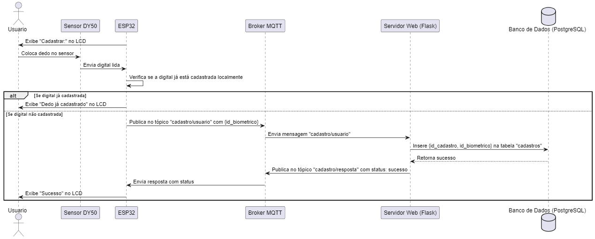

Nesta seção, apresentamos um **Diagrama de Sequência UML** que ilustra detalhadamente as interações entre os componentes do sistema em um cenário específico. Esse diagrama destaca o fluxo de mensagens e as ações realizadas pelos diferentes elementos, como o ESP32, broker MQTT, servidor web e banco de dados, ao atender a uma requisição de cadastro de digital. O protótipo físico apresentado nesta seção representa a integração de hardware e software em uma solução conectada via Wi-Fi e comunicação MQTT. Este protótipo foi projetado para validar o funcionamento completo do sistema em um ambiente conectado, permitindo o registro e monitoramento remoto de eventos, especificamente autenticações biométricas, além de fornecer feedback visual e sonoro em tempo real.

Os diagramas foram desenvolvidos com o objetivo de alinhar as funcionalidades da aplicação às necessidades dos usuários e stakeholders, evidenciando tanto o fluxo das operações quanto os estados e comportamentos do sistema. No contexto de sistemas IoT (Internet das Coisas), onde a comunicação e a integração entre dispositivos desempenham um papel central, essas representações visuais são ferramentas úteis para compreender e validar as diferentes camadas da solução.

Os Diagramas de Sequência UML cumprem um papel fundamental ao:
- **Demonstrar as interações entre componentes**: Facilitam a visualização da comunicação e colaboração entre diferentes elementos do sistema.
- **Fluxo de dados**: Detalham a troca de mensagens e respostas ao longo do tempo, permitindo identificar dependências e otimizar o desempenho.

Essa abordagem fornece aos desenvolvedores e gestores uma visão completa da solução, conectando a experiência do usuário (UX) ao funcionamento técnico e operacional do sistema. A seguir, exploramos detalhadamente cada diagrama, explicando como ele reflete a arquitetura e os fluxos de trabalho do projeto.

  Figura X - Diagrama UML - Fluxo de Cadastro de Digital 
   
  Fonte: Material produzido pelos autores (2024)

#### Registro de Situações de Uso

| **#** | **Nome do Teste**                                                                                     | **Configuração do Ambiente**                                                                                     | **Ação do Usuário**                                                                                             | **Resposta Esperada do Sistema**                                                                                                     | **Resposta Recebida do Sistema**                                                                                                                                                      |
|-------|-------------------------------------------------------------------------------------------------------|------------------------------------------------------------------------------------------------------------------|----------------------------------------------------------------------------------------------------------------|--------------------------------------------------------------------------------------------------------------------------------------|---------------------------------------------------------------------------------------------------------------------------------------------------------------------------------------|
| 01    | **Cadastro Biométrico Inicial**                                                                       | O ESP32 deve estar configurado com acesso ao Wi-Fi e conectado ao broker MQTT. O sensor biométrico e o LCD devem estar corretamente inicializados. | Colocar o dedo no sensor biométrico para iniciar o cadastro.                                                    | O sensor biométrico lê a digital e exibe no LCD: **"Cadastrar: Nome, ID"**.                                                          | O sensor leu a digital com sucesso e o LCD exibiu a mensagem de progresso no cadastro.                                                                                               |
| 02    | **Envio de Dados para o Servidor**                                                                    | O ESP32 deve estar conectado ao broker MQTT, e o servidor web deve estar funcionando com o banco de dados PostgreSQL acessível. | Realizar o cadastro no ESP32 para enviar a digital ao servidor.                                                 | O ESP32 envia os dados ao servidor, que os registra no banco de dados, retornando a mensagem de sucesso exibida no LCD: **"Sucesso"**. | O ESP32 publicou os dados corretamente, o servidor confirmou o cadastro, e o LCD exibiu a mensagem esperada.                                                                         |
| 03    | **Autenticação Biométrica e Acesso Permitido**                                                        | O ESP32 deve estar configurado para comunicação MQTT, o relé deve estar conectado à fechadura eletrônica e o LED ao sistema de feedback. | Solicitar uma autenticação biométrica no sistema colocando o dedo no sensor.                                    | O ESP32 valida a digital, acende o LED verde, exibe no LCD **"Acesso Permitido"**, e aciona o relé para liberar a fechadura.         | A autenticação foi realizada com sucesso: LED verde aceso, mensagem de permissão exibida no LCD, e o relé ativado corretamente.                                                       |
| 04    | **Reconexão Automática após Perda de Wi-Fi**                                                          | O ESP32 deve estar conectado ao broker MQTT e configurado para tentar reconectar automaticamente em caso de falha de comunicação. | Reiniciar o sistema para simular perda de conexão Wi-Fi e tentar acessar o sistema.                              | O ESP32 exibe no LCD: **"Erro na Conexão"**, tenta reconectar a cada 5 segundos e, após o sucesso, retorna ao estado normal.          | O ESP32 detectou a perda de conexão, exibiu a mensagem de erro no LCD, tentou reconectar, e restabeleceu a comunicação com o broker MQTT após algumas tentativas.                       |
| 05    | **Verificação de Duplicidade no Cadastro Biométrico**                                                 | O sensor biométrico do ESP32 deve estar configurado para verificar duplicidades no armazenamento local antes de enviar ao servidor. | Tentar cadastrar uma digital já registrada no sistema.                                                          | O ESP32 exibe no LCD: **"Dedo já cadastrado"** e interrompe o processo de cadastro.                                                  | A verificação local detectou duplicidade, exibindo corretamente a mensagem no LCD e encerrando o fluxo.                                                                              |
| 06    | **Publicação de Alertas de Falha no Sistema**                                                         | O ESP32 deve estar configurado para capturar erros e publicar alertas no tópico MQTT apropriado.                  | Simular uma falha no sensor biométrico durante o processo de leitura da digital.                                 | O ESP32 publica no tópico **"instituto/erro/sistema"** indicando a falha.                                                            | A falha foi corretamente detectada e publicada no tópico MQTT.                                                                                                                        |
| 07    | **Armazenamento de Registros no Banco de Dados** | O ESP32 deve estar configurado para enviar dados via MQTT ao servidor web, que está conectado ao banco de dados Render. O banco de dados deve estar ativo e acessível. | O ESP32 publica um registro (e.g., digital biométrica, ID ou status de acesso) para armazenamento no banco de dados. | O servidor web processa a solicitação e armazena os registros enviados pelo ESP32 no banco de dados Render. | O banco de dados registrou corretamente os dados recebidos. |

#### Explicação dos Testes

1. **Teste 1: Cadastro Biométrico Inicial**
   - **Cenário**: Início do cadastro biométrico pelo sensor.
   - **Detalhe**: O sistema lê a digital do usuário e exibe no LCD as informações necessárias para continuar o cadastro.

2. **Teste 2: Envio de Dados para o Servidor**
   - **Cenário**: Cadastro biométrico concluído e envio de dados para o servidor.
   - **Detalhe**: O ESP32 envia a digital capturada para o servidor, que armazena os dados no banco de dados e retorna uma mensagem de sucesso.

3. **Teste 3: Autenticação Biométrica e Acesso Permitido**
   - **Cenário**: Autenticação bem-sucedida pelo sistema.
   - **Detalhe**: O ESP32 valida a digital localmente e, em caso de sucesso, acende o LED verde, exibe uma mensagem de permissão no LCD, e libera a fechadura pelo relé.

4. **Teste 4: Reconexão Automática após Perda de Wi-Fi**
   - **Cenário**: Conexão com o broker MQTT perdida durante a operação.
   - **Detalhe**: O ESP32 tenta reconectar automaticamente ao broker MQTT e, após sucesso, retoma suas funções normais, exibindo mensagens de status no LCD.

5. **Teste 5: Verificação de Duplicidade no Cadastro Biométrico**
   - **Cenário**: Tentativa de cadastrar uma digital já existente.
   - **Detalhe**: O ESP32 verifica localmente se a digital já está cadastrada e, caso encontre duplicidade, exibe uma mensagem de erro no LCD e encerra o fluxo de cadastro.

6. **Teste 6: Publicação de Alertas de Falha no Sistema**
   - **Cenário**: Sensor biométrico falha durante a leitura da digital.
   - **Detalhe**: O sistema detecta a falha no sensor biométrico, publica um alerta no tópico MQTT e exibe uma mensagem de erro no LCD.

7. **Teste 7: Armazenamento de Registros no Banco de Dados**
   - **Cenário**: O servidor armazena registros enviados pelo ESP32.
   - **Detalhe**: O ESP32 envia dados como digitais biométricas ou status de acesso ao servidor, que processa e registra corretamente no banco de dados Render.

  Figura X - Diagrama UML - Fluxo de Cadastro de Digital 
   
  Fonte: Material produzido pelos autores (2024)

| **#** | **Nome do Teste**                    | **Configuração do Ambiente**                                                                                     | **Ação do Usuário**                                      | **Resposta Esperada do Sistema**                                                                                                     | **Resposta Recebida do Sistema**                                                                                                                                                      |
|-------|--------------------------------------|------------------------------------------------------------------------------------------------------------------|---------------------------------------------------------|--------------------------------------------------------------------------------------------------------------------------------------|---------------------------------------------------------------------------------------------------------------------------------------------------------------------------------------|
| 01     | **Acesso Negado**                   | O ESP32 deve estar conectado ao broker MQTT e com o banco de dados PostgreSQL acessível para verificar digitais. | Usuário coloca o dedo no sensor biométrico.             | O ESP32 exibe no LCD: **"Acesso Negado"**, acende o LED vermelho e o buzzer emite um som longo.                                       | O ESP32 exibiu no LCD: **"Acesso Negado"**, acendeu o LED vermelho e o buzzer emitiu um som longo.                                                                                    |
| 02     | **Acesso Permitido**                | O ESP32 conectado ao broker MQTT, servidor web Flask ativo e banco PostgreSQL com a digital cadastrada.          | Usuário coloca o dedo no sensor biométrico.             | O ESP32 exibe no LCD: **"Acesso Permitido"**, LED verde acende, e o relé libera a fechadura.                                          | O ESP32 exibiu no LCD: **"Acesso Permitido"**, LED verde acendeu, e o relé ativou a fechadura corretamente.                                                                           |
| 03     | **Banco de Dados Inacessível**      | O ESP32 conectado ao broker MQTT, mas o banco de dados PostgreSQL está offline.                                  | Usuário coloca o dedo no sensor biométrico.             | O ESP32 exibe no LCD: **"Erro no Sistema"**.  | O ESP32 exibiu no LCD: **"Erro no Sistema"**.                                                                                   |
| 04     | **Reconexão Automática**            | O ESP32 perdeu a conexão com o broker MQTT e tenta reconectar automaticamente.                                   | Reiniciar o sistema para simular perda de conexão Wi-Fi. | O ESP32 exibe no LCD: **"Erro na Conexão"**, tenta reconectar a cada 5 segundos e, após sucesso, retorna ao estado normal.            | O ESP32 detectou a perda de conexão, exibiu no LCD: **"Erro na Conexão"**, tentou reconectar, mas não restabeleceu a comunicação com o broker MQTT após tentativas.                    |
| 05     | **Digital já Cadastrada**           | O ESP32 configurado com verificações locais e conexão ao broker MQTT.                                            | Tentar cadastrar uma digital já registrada no sistema.  | O ESP32 exibe no LCD: **"Dedo já cadastrado"** e interrompe o processo de cadastro.                                                  | O ESP32 exibiu corretamente no LCD: **"Dedo já cadastrado"** e encerrou o fluxo de cadastro.                                                                                           |
| 06     | **Falha no Sensor Biométrico**      | O ESP32 conectado ao broker MQTT, mas o sensor biométrico não responde.                                          | Colocar o dedo no sensor biométrico.                    | O ESP32 publica no tópico **"instituto/erro/sistema"** indicando a falha e exibe no LCD: **"Erro no Sensor"**.                        | A falha foi corretamente detectada, o ESP32 publicou no tópico MQTT, e o LCD exibiu a mensagem: **"Erro no Sensor"**.                                                                 |
---

#### Explicação dos Testes

1. **Teste 1: Acesso Negado**
   - **Cenário**: Digital não encontrada no banco de dados local.
   - **Detalhe**: O sistema verifica localmente a digital e, se não encontrar, exibe uma mensagem negativa no LCD.

2. **Teste 2: Acesso Permitido**
   - **Cenário**: Digital encontrada e validada com sucesso.
   - **Detalhe**: O ESP32 executa uma consulta localmente, valida a digital e retorna feedback ao usuário.

3. **Teste 3: Banco de Dados Inacessível**
   - **Cenário**: O banco de dados não está acessível.
   - **Detalhe**: O ESP32 detecta o erro e publica mensagens de falha no tópico MQTT.

4. **Teste 4: Reconexão Automática**
   - **Cenário**: Perda de conexão Wi-Fi.
   - **Detalhe**: O ESP32 tenta reconectar ao broker MQTT automaticamente e retoma as operações normais.

5. **Teste 5: Digital já Cadastrada**
   - **Cenário**: Tentativa de cadastrar uma digital duplicada.
   - **Detalhe**: O ESP32 realiza uma verificação local e impede o fluxo de cadastro.

6. **Teste 6: Falha no Sensor Biométrico**
   - **Cenário**: Sensor biométrico não responde corretamente.
   - **Detalhe**: O sistema detecta a falha e publica alertas no broker MQTT.

### **Configuração do Ambiente**

Para realizar os testes descritos, o ambiente deve estar configurado da seguinte forma:

#### **Hardware**
- **ESP32**: Microcontrolador central responsável pela comunicação com sensores e o broker MQTT.
- **Sensor Biométrico (DY50)**: Captura impressões digitais para autenticação e cadastro.
- **Relé**: Controla a abertura de fechaduras eletrônicas.
- **LEDs**:
  - Verde: Indica sucesso em autenticação.
  - Vermelho: Indica falha na autenticação.
  - Azul: Indica que o sistema está em plen o funcionamento.
- **Buzzer**: Emite sinais sonoros como feedback adicional.
- **Display LCD (I2C)**: Exibe mensagens em tempo real para o usuário, como "Acesso Permitido", "Acesso Negado" e "Erro no Cadastro".

### **Software**
- **Conexão Wi-Fi**: Configurada para conectar o ESP32 ao broker MQTT (Deve ser configurada através do hotspot). 
- **Broker MQTT (HiveMQ Cloud)**:
  - Centraliza a comunicação de eventos, registrando mensagens enviadas pelo protótipo.
  - Tópicos configurados:
    - `instituto/cadastro`
    - `instituto/acesso`
- **Servidor Web (Flask)**:
  - Recebe os dados publicados pelo ESP32 via MQTT.
  - Processa e registra as informações no banco de dados.

- **Banco de Dados (Render)**:
- Recebe os registros do ESP32 e os armazena. 
---

### Tabela de Componentes Utilizados

### Tabela de Componentes Utilizados

| **Componente**              | **Descrição**                                                                                   | **Função no Sistema**                                                                                   | **Quantidade** |
|------------------------------|-----------------------------------------------------------------------------------------------|---------------------------------------------------------------------------------------------------------|----------------|
| **ESP32**                    | Microcontrolador com suporte a Wi-Fi e Bluetooth.                                             | Gerencia a comunicação entre os sensores, servidor e feedback ao usuário.                               | 1              |
| **Sensor Biométrico DY50**   | Sensor de leitura de digitais.                                                               | Captura digitais para cadastro e autenticação.                                                          | 1              |
| **LCD I2C (16x2)**           | Display com comunicação via I2C.                                                             | Exibe mensagens de status e feedback ao usuário.                                                        | 1              |
| **LED RGB**                  | LED tricolor (vermelho, verde, azul).                                                        | Indica status de operação, como sucesso, falha ou erro na conexão.                                      | 1              |
| **Buzzer**                   | Emissor de som.                                                                              | Emite sons para indicar feedback, como falhas ou sucesso nas operações.                                 | 1              |
| **Relé**                     | Interruptor eletrônico.                                                                      | Controla a abertura da fechadura eletrônica.                                                            | 1              |
| **Fechadura Eletrônica**     | Fechadura operada eletronicamente.                                                           | Controla o acesso físico ao ambiente.                                                                   | 1              |
| **MQTT Broker (HiveMQ)**     | Protocolo de comunicação IoT.                                                                | Facilita a comunicação entre o ESP32 e o servidor.                                                      | 1 (virtual)    |
| **Servidor Web (Flask)**     | Servidor web escrito em Python.                                                              | Processa requisições do ESP32 e interage com o banco de dados.                                          | 1 (virtual)    |
| **Banco de Dados PostgreSQL**| Sistema de gerenciamento de banco de dados relacional.                                       | Armazena informações de cadastro, autenticações e registros de acesso.                                  | 1 (virtual)    |
| **Fonte de Alimentação 5V**  | Fonte de energia.                                                                            | Alimenta os componentes do sistema, como ESP32, LCD, sensor biométrico e LED.                           | 1              |
| **Resistores e Cabos**       | Componentes eletrônicos auxiliares.                                                         | Conexões elétricas e controle de tensão nos circuitos.                                                  | Variado        |
| **Conexão Wi-Fi**            | Rede sem fio.                                                                                | Permite a comunicação do ESP32 com o broker MQTT e o servidor.                                          | 1 (infraestrutura) |

